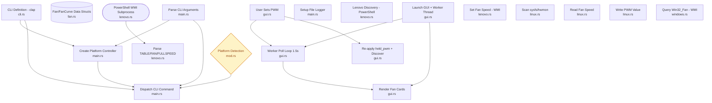

# fancontrol


A minimal cross-platform app to monitor and control fan speed on Linux and Windows.

## Quickstart

```bash
# Install Rust (if not already installed)
curl --proto '=https' --tlsv1.2 -sSf https://sh.rustup.rs | sh

# Clone and build
git clone https://github.com/pjt222/fancontrol.git
cd fancontrol
cargo build --release

# Run (Linux — may need sudo for PWM write access)
sudo ./target/release/fancontrol list

# Run (Windows — needs Administrator for WMI access)
.\target\release\fancontrol.exe list
```

### Quick commands

```bash
fancontrol list                    # Show all detected fans
fancontrol get fan0                # Get fan0 speed in RPM
fancontrol set fan0 128            # Set fan0 to 50% duty cycle
fancontrol monitor                 # Live fan monitor (Ctrl+C to stop)
fancontrol table                   # Display EC fan curve data
fancontrol tui                     # Interactive terminal dashboard
fancontrol gui                     # Graphical interface
fancontrol list --json             # Machine-readable JSON output
fancontrol set-curve --fan-id 0 --sensor-id 3 --steps "1,1,1,1,2,4,6,7,8,10"  # Custom fan curve (Lenovo)
```

## Features

- **CLI** with subcommands: `list`, `get`, `set`, `monitor`, `table`, `set-curve`, `tui`, `gui`
- **JSON output** (`--json`) for `list`, `get`, and `table` commands
- **TUI** (ratatui) interactive terminal dashboard with keyboard-driven PWM control
- **GUI** (egui/eframe) with per-fan sliders, real-time polling, and fan curve display
- **Custom fan curves** for Lenovo Legion via `Fan_Set_Table` with safety validation
- **Linux**: sysfs/hwmon backend — reads `fan*_input`, writes `pwm*`
- **Windows**: WMI backend — generic `Win32_Fan` (read-only) with Lenovo Legion vendor support
- **Lenovo Legion**: full speed toggle, manual RPM control, SmartFanMode, EC fan table/curve display

## Architecture Diagram

Generated with [putior](https://github.com/pjt222/putior) from `// put` annotations in source.


```mermaid
flowchart TD
    cli_def["CLI Definition - clap<br/>cli.rs"]
    fan_structs[("Fan/FanCurve Data Structs<br/>fan.rs")]
    gui_init["Launch GUI + Worker Thread<br/>gui.rs"]
    worker_loop["Worker Poll Loop 1.5s<br/>gui.rs"]
    worker_refresh["Re-apply held_pwm + Discover<br/>gui.rs"]
    ui_render["Render Fan Cards<br/>gui.rs"]
    ui_set_pwm["User Sets PWM<br/>gui.rs"]
    cli_parse["Parse CLI Arguments<br/>main.rs"]
    setup_logging["Setup File Logger<br/>main.rs"]
    create_ctrl["Create Platform Controller<br/>main.rs"]
    dispatch["Dispatch CLI Command<br/>main.rs"]
    lenovo_discover["Lenovo Discovery - PowerShell<br/>lenovo.rs"]
    lenovo_ps(["PowerShell WMI Subprocess<br/>lenovo.rs"])
    lenovo_parse["Parse TABLE/FAN/FULLSPEED<br/>lenovo.rs"]
    lenovo_set["Set Fan Speed - WMI<br/>lenovo.rs"]
    linux_discover["Scan sysfs/hwmon<br/>linux.rs"]
    linux_read["Read Fan Speed<br/>linux.rs"]
    linux_write["Write PWM Value<br/>linux.rs"]
    platform_select{"Platform Detection<br/>mod.rs"}
    win_wmi["Query Win32_Fan - WMI<br/>windows.rs"]

    %% Connections
    gui_init --> worker_loop
    ui_set_pwm --> worker_loop
    ui_set_pwm --> worker_refresh
    gui_init --> ui_render
    worker_loop --> ui_render
    cli_def --> create_ctrl
    cli_parse --> create_ctrl
    cli_def --> dispatch
    cli_parse --> dispatch
    create_ctrl --> dispatch
    platform_select --> dispatch
    lenovo_ps --> lenovo_parse

    %% Styling
    classDef decisionStyle fill:#fef3c7,stroke:#d97706,stroke-width:2px,color:#92400e
    class platform_select decisionStyle
```

## Build

Requires [Rust](https://rustup.rs/).

```bash
cargo build --release
```

### Cross-compile from WSL to Windows

```bash
rustup target add x86_64-pc-windows-gnu
sudo apt-get install mingw-w64
cargo build --release --target x86_64-pc-windows-gnu
```

The binary will be at `target/x86_64-pc-windows-gnu/release/fancontrol.exe`.

## Usage

### List fans

```bash
fancontrol list              # Human-readable table
fancontrol list --json       # JSON output
```

### Get fan speed

```bash
fancontrol get <FAN_ID>
fancontrol get fan0 --json   # {"fan_id":"fan0","rpm":2100}
```

### Set fan PWM

```bash
fancontrol set <FAN_ID> <PWM>   # PWM 0-255
```

### Monitor fans in real-time

```bash
fancontrol monitor [-i <SECONDS>]   # Default: 1s refresh
```

### Display EC fan curves

```bash
fancontrol table                 # All curves
fancontrol table --fan-id 0      # CPU fan only
fancontrol table --json          # JSON output
```

### Set custom fan curve (Lenovo only)

```bash
# 10 comma-separated speed step indices (0-10 scale)
fancontrol set-curve --fan-id 0 --sensor-id 3 --steps "1,1,1,1,2,4,6,7,8,10"
```

Steps index into the hardware's FanSpeeds array from `LENOVO_FAN_TABLE_DATA`. Safety validation enforces non-decreasing values and minimum thresholds at high temperatures. Requires Custom SmartFanMode (auto-switched). Curves are volatile (lost on reboot/sleep).

### Interactive TUI dashboard

```bash
fancontrol tui
```

Keyboard controls: `j`/`k` select fan, `Enter` edit PWM, `h`/`l` adjust +/-5, `+`/`-` fine +/-1, `Home`/`End` min/max, `Esc` cancel, `q` quit.

### Open the GUI

```bash
fancontrol gui
```

### Verbosity

Use `-v` flags to increase log verbosity (written to `fancontrol.log`):

```bash
fancontrol -v list       # Info level
fancontrol -vv list      # Debug level
fancontrol -vvv list     # Trace level
```

Default log level is Warn.

## PWM semantics

### Linux (sysfs/hwmon)

| PWM | Meaning |
|-----|---------|
| 0 | Fan off |
| 1-254 | Proportional duty cycle |
| 255 | Full speed |

### Lenovo Legion (WMI)

| PWM | Meaning |
|-----|---------|
| 0 | Return to BIOS auto control |
| 1-254 | Manual RPM (mapped to fan RPM range) |
| 255 | Full speed mode |

## Platform notes

**Linux**: Scans `/sys/class/hwmon/` for fan inputs and PWM files. Requires write permissions on `pwm*` files (run as root or configure udev rules).

**Windows (generic)**: Queries `Win32_Fan` WMI class. Most hardware does not expose fans through this class — results are often empty.

**Windows (Lenovo Legion)**: Detected automatically via `Win32_ComputerSystem.Manufacturer`. Uses `LENOVO_FAN_METHOD` and `LENOVO_FAN_TABLE_DATA` in the `root\WMI` namespace via PowerShell subprocess. Requires administrator privileges.

## Known limitations

- Linux backend requires root or appropriate permissions for PWM write access
- Windows generic `Win32_Fan` is read-only — vendor-specific WMI is needed for control
- Lenovo WMI `Fan_Get_Table` and `Fan_Get_MaxSpeed` return empty data on some firmware
- `Fan_Set_Table` call succeeds but behavioral effect is unverified at idle temperatures (needs load test above 58°C)
- Custom curves are volatile — lost on reboot, sleep/wake, or power mode change (Fn+Q)

## Acknowledgments

- [LenovoLegionToolkit](https://github.com/BartoszCichecki/LenovoLegionToolkit) — community knowledge of Lenovo WMI fan control classes and methods
- [FanControl](https://github.com/Rem0o/FanControl.Releases) by Rem0o — Windows fan monitoring and control
- [lm-sensors](https://github.com/lm-sensors/lm-sensors) — Linux hwmon sysfs conventions for fan speed and PWM control

## License

[MIT](LICENSE)
