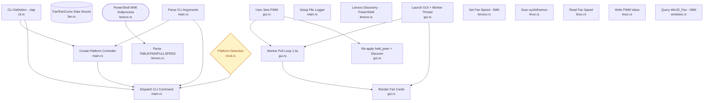

# fancontrol

[](https://github.com/pjt222/fancontrol/actions/workflows/ci.yml)
[](https://deepwiki.com/pjt222/fancontrol)

Minimal cross-platform fan speed control — CLI, TUI dashboard, and GUI for Linux & Windows. Lenovo Legion fan curve support via WMI.

**[Landing page](https://pjt222.github.io/fancontrol/)** · **[GitHub](https://github.com/pjt222/fancontrol)**

## Quickstart

```bash
# Install Rust (if not already installed)
curl --proto '=https' --tlsv1.2 -sSf https://sh.rustup.rs | sh

# Clone and build
git clone https://github.com/pjt222/fancontrol.git
cd fancontrol
cargo build --release

# Run (Linux — may need sudo for PWM write access)
sudo ./target/release/fancontrol list

# Run (Windows — needs Administrator for WMI access)
.\target\release\fancontrol.exe list
```

### Quick commands

```bash
fancontrol list                    # Show all detected fans
fancontrol get fan0                # Get fan0 speed in RPM
fancontrol set fan0 128            # Set fan0 to 50% duty cycle
fancontrol monitor                 # Live fan monitor (Ctrl+C to stop)
fancontrol table                   # Display EC fan curve data
fancontrol led                     # Power-button LED colour and where it was read from
fancontrol tui                     # Interactive terminal dashboard
fancontrol gui                     # Graphical interface
fancontrol list --json             # Machine-readable JSON output

# Custom fan curve with config persistence (Lenovo)
fancontrol set-curve --fan-id 0 --sensor-id 3 \
  --steps "1,1,1,1,2,4,6,7,8,10" --save
```

## Features

- **CLI** with subcommands: `list`, `get`, `set`, `monitor`, `table`, `set-curve`, `led`, `tui`, `gui`
- **JSON output** (`--json`) for `list`, `get`, `table`, and `led` commands
- **TUI dashboard** (ratatui) with viridis color scheme, real-time fan/temp display, interactive curve editor, and keyboard-driven controls
- **GUI** (egui/eframe) with per-fan sliders, EC fan-curve display, real-time polling, and a header showing the SmartFanMode and the power-button LED colour (#44). No curve editor yet; that exists only on the unmerged `phase-4-5-config-gui-curves` branch
- **Config persistence** — save custom curves to `fancontrol.json` with `--save`; auto-reapplied on startup
- **Custom fan curves** for Lenovo Legion via `Fan_Set_Table` with safety validation
- **Linux**: sysfs/hwmon backend — reads `fan*_input`, writes `pwm*`
- **Windows**: WMI backend — generic `Win32_Fan` (read-only) with Lenovo Legion vendor support
- **Lenovo Legion**: full speed toggle, SmartFanMode (Quiet/Balanced/Performance/Custom), EC fan curve display and editing

## Architecture Diagram

Generated with [putior](https://github.com/pjt222/putior) from `// put` annotations in source.


```mermaid
flowchart TD
    cli_def["CLI Definition - clap<br/>cli.rs"]
    fan_structs[("Fan/FanCurve Data Structs<br/>fan.rs")]
    gui_init["Launch GUI + Worker Thread<br/>gui.rs"]
    worker_loop["Worker Poll Loop 1.5s<br/>gui.rs"]
    worker_refresh["Re-apply held_pwm + Discover<br/>gui.rs"]
    ui_render["Render Fan Cards<br/>gui.rs"]
    ui_set_pwm["User Sets PWM<br/>gui.rs"]
    cli_parse["Parse CLI Arguments<br/>main.rs"]
    setup_logging["Setup File Logger<br/>main.rs"]
    create_ctrl["Create Platform Controller<br/>main.rs"]
    dispatch["Dispatch CLI Command<br/>main.rs"]
    lenovo_discover["Lenovo Discovery - PowerShell<br/>lenovo.rs"]
    lenovo_ps(["PowerShell WMI Subprocess<br/>lenovo.rs"])
    lenovo_parse["Parse TABLE/FAN/FULLSPEED<br/>lenovo.rs"]
    lenovo_set["Set Fan Speed - WMI<br/>lenovo.rs"]
    linux_discover["Scan sysfs/hwmon<br/>linux.rs"]
    linux_read["Read Fan Speed<br/>linux.rs"]
    linux_write["Write PWM Value<br/>linux.rs"]
    platform_select{"Platform Detection<br/>mod.rs"}
    win_wmi["Query Win32_Fan - WMI<br/>windows.rs"]

    %% Connections
    gui_init --> worker_loop
    ui_set_pwm --> worker_loop
    ui_set_pwm --> worker_refresh
    gui_init --> ui_render
    worker_loop --> ui_render
    cli_def --> create_ctrl
    cli_parse --> create_ctrl
    cli_def --> dispatch
    cli_parse --> dispatch
    create_ctrl --> dispatch
    platform_select --> dispatch
    lenovo_ps --> lenovo_parse

    %% Styling
    classDef decisionStyle fill:#fef3c7,stroke:#d97706,stroke-width:2px,color:#92400e
    class platform_select decisionStyle
```

## Build

Requires [Rust](https://rustup.rs/).

```bash
cargo build --release
```

### Cross-compile from WSL to Windows

```bash
rustup target add x86_64-pc-windows-gnu
sudo apt-get install mingw-w64
cargo build --release --target x86_64-pc-windows-gnu
```

The binary will be at `target/x86_64-pc-windows-gnu/release/fancontrol.exe`.

## Usage

### List fans

```bash
fancontrol list              # Human-readable table
fancontrol list --json       # JSON output
```

### Get fan speed

```bash
fancontrol get <FAN_ID>
fancontrol get fan0 --json   # {"fan_id":"fan0","rpm":2100}
```

### Set fan PWM

```bash
fancontrol set <FAN_ID> <PWM>   # PWM 0-255
```

### Monitor fans in real-time

```bash
fancontrol monitor [-i <SECONDS>]   # Default: 1s refresh
```

### Display EC fan curves

```bash
fancontrol table                 # All curves
fancontrol table --fan-id 0      # CPU fan only
fancontrol table --json          # JSON output
```

### Set custom fan curve (Lenovo only)

```bash
# 10 comma-separated speed step indices (0-10 scale)
fancontrol set-curve --fan-id 0 --sensor-id 3 --steps "1,1,1,1,2,4,6,7,8,10"

# Save to config for automatic re-application on startup
fancontrol set-curve --fan-id 0 --sensor-id 3 --steps "1,1,1,1,2,4,6,7,8,10" --save
```

Steps index into the hardware's FanSpeeds array from `LENOVO_FAN_TABLE_DATA`, one step per temperature band, lowest band first. Requires Custom SmartFanMode: `set-curve` switches to it and, on success, leaves the machine there running the new curve. Fn+Q moves it to Quiet/Balanced/Performance; the curve stays stored in the EC and runs again the next time Custom is selected.

**Step limits.** A curve is rejected outright if it breaks any of these — `set-curve` does not quietly adjust your input:

| Constraint | Rule |
|---|---|
| Range | every step is 0–10 |
| Order | steps are non-decreasing |
| Step 7 floor | ≥ 1 |
| Step 8 floor | ≥ 3 |
| Step 9 floor | ≥ 5 |

The three floors sit on the highest temperature bands and match LenovoLegionToolkit's GodMode V1 minimum table, `[0,0,0,0,0,0,0,1,3,5]`.

> **Breaking change, 2026-08-12.** The step 7 floor is new. `set-curve` invocations with step 7 at 0 were accepted before that date and now fail with `platform error: step 7 (approaching high temp) must be >= 1 for safety, got 0`. See [CHANGELOG.md](CHANGELOG.md).

**Saved curves are never rewritten on disk.** If a curve in `fancontrol.json` falls outside the limits above — because it predates them, or was hand-edited — it is adjusted in memory before being applied, and the adjustment is reported once per session along with the path to the file. The file itself is left alone until you save deliberately (`s` in the TUI). The adjustment therefore recurs on every launch until you fix or re-save the curve, which is the intended trade: sanitizing raises values to restore ordering, so the repair can be drastic, and overwriting a file you wrote is not something the program should do unasked.

**Steps 0–6 may be 0, and 0 stops the fan.** Measured 2026-08-19 ([#18](https://github.com/pjt222/fancontrol/issues/18)): with the minimum table `[0,0,0,0,0,0,0,1,3,5]` in force, both fans held 0 RPM across 17 consecutive samples at 58–62 °C under load, and Performance mode brought 2200 RPM straight back. `CurrentFanMinSpeed = 1600` is the slowest the fan turns *while turning*, not a floor the curve produces. So a curve whose low bands are 0 runs the machine with its fans stopped up to the first non-zero band; the floors permit that on steps 0–6, and the step 7 floor of 1 is where the fan is guaranteed to turn. Choose zeros deliberately.

### Show the power-button LED (Lenovo only)

```bash
fancontrol led           # button colour white (read: Lighting_Id 4 index 1); SmartFanMode 3 (Performance)
fancontrol led --json    # {"lighting_id":4,"state_index":1,"smart_fan_mode":3,"colour":"white","source":"read"}
```

Reads `LENOVO_LIGHTING_METHOD.Get_Lighting_Current_Status(4)` and maps the state index to the colour measured for it (0 blue, 1 white, 2 red, 3 multi; 2026-09-02). When the read fails, the colour is derived from SmartFanMode and labelled so. The two are not the same thing: with Performance selected and the AC adapter out, the register still reads 3 while the index reads 1 and the button is white (measured 2026-09-03, [#44](https://github.com/pjt222/fancontrol/issues/44)). Which physical LED the index describes is unproven; its index has matched the button in every observed state. The TUI title and the GUI header show the same indicator, and the lighting class is only ever read, never written.

### Interactive TUI dashboard

```bash
fancontrol tui
```

Viridis-themed terminal dashboard with real-time fan speeds, temperature readings, and an interactive curve editor.

**Fan select mode**: `j`/`k` select fan, `Tab`/`Shift+Tab` cycle sensor, `Enter` edit curve, `f` toggle full speed, `a` apply curve, `s` save to config, `r` reset to BIOS, `q` quit.

**Curve edit mode**: `j`/`k` select step, `h`/`l` adjust value +/-1, `Enter`/`a` apply and exit, `s` apply and save, `Esc` revert changes.

### Open the GUI

```bash
fancontrol gui
```

### Verbosity

Use `-v` flags to increase log verbosity (written to `fancontrol.log`):

```bash
fancontrol -v list       # Info level
fancontrol -vv list      # Debug level
fancontrol -vvv list     # Trace level
```

Default log level is Warn.

## PWM semantics

### Linux (sysfs/hwmon)

| PWM | Meaning |
|-----|---------|
| 0 | Fan off |
| 1-254 | Proportional duty cycle |
| 255 | Full speed |

### Lenovo Legion (WMI)

| PWM | Meaning |
|-----|---------|
| 0 | Return to BIOS auto control |
| 1-254 | Manual RPM (mapped to fan RPM range) |
| 255 | Full speed mode |

## Platform notes

**Linux**: Scans `/sys/class/hwmon/` for fan inputs and PWM files. Requires write permissions on `pwm*` files (run as root or configure udev rules).

**Windows (generic)**: Queries `Win32_Fan` WMI class. Most hardware does not expose fans through this class — results are often empty.

**Windows (Lenovo Legion)**: Detected automatically via `Win32_ComputerSystem.Manufacturer`. Uses `LENOVO_FAN_METHOD` and `LENOVO_FAN_TABLE_DATA` in the `root\WMI` namespace via PowerShell subprocess. Requires administrator privileges.

## Known limitations

- Linux backend requires root or appropriate permissions for PWM write access
- Windows generic `Win32_Fan` is read-only — vendor-specific WMI is needed for control
- Lenovo WMI `Fan_Get_Table` and `Fan_Get_MaxSpeed` return empty data on some firmware
- `Fan_Set_Table` is confirmed working on the Legion 82RG (#10, load test 2026-08-19: an all-10s curve held 4800 RPM at 61–64 °C where the no-write control sat at 0 RPM), but only fan 0 / sensor 3 has been exercised, and `--fan-id` / `--sensor-id` are accepted without being encoded (#42)
- The power-button LED indicator reads `Lighting_Id 4`; which physical LED that id describes is unproven, and whether the fans and power limits follow the button on battery is unmeasured (#44)
- The EC **retains** the last written curve across power-mode switches (measured 2026-08-19; the earlier "lost on power mode change" note here was wrong). Reboot and sleep/wake retention are unmeasured. A retained curve is *latent*: it runs whenever anything selects Custom mode, so leave a safe one behind after experiments (`tools/Reset-LenovoFanState.ps1`). Use `--save` or the TUI `s` key to persist curves for automatic re-application on startup

## Acknowledgments

- [LenovoLegionToolkit](https://github.com/BartoszCichecki/LenovoLegionToolkit) — community knowledge of Lenovo WMI fan control classes and methods
- [FanControl](https://github.com/Rem0o/FanControl.Releases) by Rem0o — Windows fan monitoring and control
- [lm-sensors](https://github.com/lm-sensors/lm-sensors) — Linux hwmon sysfs conventions for fan speed and PWM control

## License

[MIT](LICENSE)
