# fancontrol


A minimal cross-platform app to monitor and control fan speed on Linux and Windows.

## Features

- **CLI** with subcommands: `list`, `get`, `set`, `monitor`, `table`, `set-curve`, `backup-curves`, `restore-curves`, `gui`
- **GUI** (egui/eframe) with per-fan sliders, real-time polling, fan curve display, and editable fan curves
- **Linux**: sysfs/hwmon backend — reads `fan*_input`, writes `pwm*`
- **Windows**: WMI backend — generic `Win32_Fan` (read-only) with Lenovo Legion vendor support
- **Lenovo Legion**: full speed toggle, manual RPM control, EC fan table/curve display, custom fan curve writing
- **Safety**: Fan curve validation prevents writing curves that could cause overheating
- **Backup/Restore**: Save and restore fan curves to/from JSON files

## Architecture Diagram

Generated with [putior](https://github.com/pjt222/putior) from `// put` annotations in source.

```mermaid
flowchart TD
    cli_def["CLI Definition - clap<br/>cli.rs"]
    fan_structs[("Fan/FanCurve Data Structs<br/>fan.rs")]
    gui_init["Launch GUI + Worker Thread<br/>gui.rs"]
    worker_loop["Worker Poll Loop 1.5s<br/>gui.rs"]
    worker_refresh["Re-apply held_pwm + Discover<br/>gui.rs"]
    ui_render["Render Fan Cards<br/>gui.rs"]
    ui_set_pwm["User Sets PWM<br/>gui.rs"]
    cli_parse["Parse CLI Arguments<br/>main.rs"]
    setup_logging["Setup File Logger<br/>main.rs"]
    create_ctrl["Create Platform Controller<br/>main.rs"]
    dispatch["Dispatch CLI Command<br/>main.rs"]
    lenovo_discover["Lenovo Discovery - PowerShell<br/>lenovo.rs"]
    lenovo_ps(["PowerShell WMI Subprocess<br/>lenovo.rs"])
    lenovo_parse["Parse TABLE/FAN/FULLSPEED<br/>lenovo.rs"]
    lenovo_set["Set Fan Speed - WMI<br/>lenovo.rs"]
    linux_discover["Scan sysfs/hwmon<br/>linux.rs"]
    linux_read["Read Fan Speed<br/>linux.rs"]
    linux_write["Write PWM Value<br/>linux.rs"]
    platform_select{"Platform Detection<br/>mod.rs"}
    win_wmi["Query Win32_Fan - WMI<br/>windows.rs"]

    %% Connections
    gui_init --> worker_loop
    ui_set_pwm --> worker_loop
    ui_set_pwm --> worker_refresh
    gui_init --> ui_render
    worker_loop --> ui_render
    cli_def --> create_ctrl
    cli_parse --> create_ctrl
    cli_def --> dispatch
    cli_parse --> dispatch
    create_ctrl --> dispatch
    platform_select --> dispatch
    lenovo_ps --> lenovo_parse

    %% Styling
    classDef decisionStyle fill:#fef3c7,stroke:#d97706,stroke-width:2px,color:#92400e
    class platform_select decisionStyle
```



## Build

Requires [Rust](https://rustup.rs/).

```bash
cargo build --release
```

### Cross-compile from WSL to Windows

```bash
rustup target add x86_64-pc-windows-gnu
sudo apt-get install mingw-w64
cargo build --release --target x86_64-pc-windows-gnu
```

The binary will be at `target/x86_64-pc-windows-gnu/release/fancontrol.exe`.

## Usage

### List fans

```
fancontrol list
```

### Get fan speed

```
fancontrol get <FAN_ID>
```

### Set fan PWM

```
fancontrol set <FAN_ID> <PWM>
```

### Monitor fans in real-time

```
fancontrol monitor [-i <SECONDS>]
```

### Display EC fan curves

```
fancontrol table [--fan-id <ID>]
```

### Set a custom fan curve

Write a custom temperature→RPM curve to the EC (Lenovo only). Points are specified as `temperature:rpm` pairs.

```
fancontrol set-curve --fan-id 0 --sensor-id 3 55:1600 63:2100 70:3200 85:4800
```

Safety validation is performed before writing:
- Temperatures must be strictly increasing
- Fan speeds must be non-decreasing
- The highest temperature point must have at least 50% of the fan's max RPM

### Back up fan curves

Save the current fan curves to a JSON file:

```
fancontrol backup-curves [-o fan_curves_backup.json]
```

### Restore fan curves

Restore fan curves from a previously saved backup:

```
fancontrol restore-curves [-i fan_curves_backup.json]
```

### Open the GUI

```
fancontrol gui
```

### Verbosity

Use `-v` flags to increase log verbosity (written to `fancontrol.log`):

```
fancontrol -v list       # Info level
fancontrol -vv list      # Debug level
fancontrol -vvv list     # Trace level
```

Default log level is Warn.

## PWM semantics

### Linux (sysfs/hwmon)

| PWM | Meaning |
|-----|---------|
| 0 | Fan off |
| 1-254 | Proportional duty cycle |
| 255 | Full speed |

### Lenovo Legion (WMI)

| PWM | Meaning |
|-----|---------|
| 0 | Return to BIOS auto control |
| 1-254 | Manual RPM (mapped to fan RPM range) |
| 255 | Full speed mode |

## Platform notes

**Linux**: Scans `/sys/class/hwmon/` for fan inputs and PWM files. Requires write permissions on `pwm*` files (run as root or configure udev rules).

**Windows (generic)**: Queries `Win32_Fan` WMI class. Most hardware does not expose fans through this class — results are often empty.

**Windows (Lenovo Legion)**: Detected automatically via `Win32_ComputerSystem.Manufacturer`. Uses `LENOVO_FAN_METHOD` and `LENOVO_FAN_TABLE_DATA` in the `root\WMI` namespace via PowerShell subprocess. Requires administrator privileges.

## Known limitations

- Linux backend requires root or appropriate permissions for PWM write access
- Windows generic `Win32_Fan` is read-only — vendor-specific WMI is needed for control
- Lenovo WMI `Fan_Get_Table` and `Fan_Get_MaxSpeed` return empty data on some firmware
- Custom fan curve writing (`Fan_Set_Table`) byte format is based on reverse-engineering and may vary across firmware versions
- Custom fan curves may not persist across reboots (firmware may re-flash defaults)

## Acknowledgments

- [LenovoLegionToolkit](https://github.com/BartoszCichecki/LenovoLegionToolkit) — community knowledge of Lenovo WMI fan control classes and methods
- [FanControl](https://github.com/Rem0o/FanControl.Releases) by Rem0o — Windows fan monitoring and control
- [lm-sensors](https://github.com/lm-sensors/lm-sensors) — Linux hwmon sysfs conventions for fan speed and PWM control

## License

[MIT](LICENSE)
